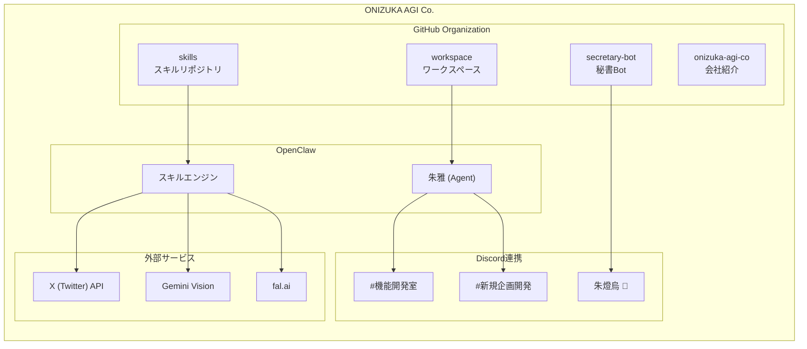

# ONIZUKA AGI Co. 構成図

> **Democratizing AGI knowledge** - AGIの知見をほどき、世界に届ける

## 組織全体構成

## GitHubリポジトリ一覧

| リポジトリ | 説明 | 主な内容 |
|------------|------|----------|
| `onizuka-agi-co/skills` | スキル定義 | X API、Gemini、日報管理等 |
| `onizuka-agi-co/workspace` | ワークスペース | エージェント設定、記憶、日報 |
| `onizuka-agi-co/secretary-bot` | 秘書Bot | Discord通知、タスク管理 |
| `onizuka-agi-co/onizuka-agi-co` | 会社紹介 | README、構成図 |

## スキル一覧

### X (Twitter) 関連
- **x-read** - X API読み込み（タイムライン、検索）
- **x-write** - X API書き込み（投稿、いいね）
- **x-community** - コミュニティ投稿
- **sunwood-community** - Sunwood AI OSS Hub投稿

### AI/LLM関連
- **gemini-vision** - Gemini Vision API（画像分析）
- **glm-code** - Claude Code via GLM
- **nano-banana-2** - fal.ai画像生成

### 開発支援
- **daily-memory** - 日報管理
- **idea-dev** - 新規企画開発
- **google-browse** - Google検索・ブラウズ

### インフラ
- **futodama-s6-service** - FUTODAMA S6サービス
- **discord-webhook-periodic** - 定期Discord通知

## Discord連携

### チャンネル構成
- **#機能開発室** - タスク管理、開発議論
- **#新規企画開発** - アイデア提案

### Bot
- **朱燈烏 🔔** - 秘書Bot（定期通知、タスク確認）

## OpenClaw構成

### エージェント
- **朱雅（しゅが）** - メインエージェント
  - 鬼（妖怪世界の高位種）
  - 結界と祭儀を司る「朱の守護者」

### 設定ファイル
- `SOUL.md` - 魂・人格設定
- `IDENTITY.md` - アイデンティティ
- `AGENTS.md` - エージェント設定
- `HEARTBEAT.md` - 定期タスク指示

---

_更新日: 2026-03-01_
